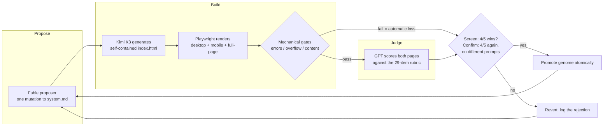

# autodesign

**A self-improving design agent that doesn't trust itself.**

autodesign is an autoresearch loop that evolves the system prompt (the "genome") of a landing-page-generating agent. Every iteration it proposes one mutation to the genome, generates real pages, renders them in a real browser, and scores them against a fixed 29-item design rubric — judged visually by a *different model family*. A mutation is only promoted if it wins a two-stage acceptance gauntlet with a ~3.5% false-accept rate under the null. Everything else is reverted.

No gradient descent. No fine-tuning. Just an agent rewriting its own instructions and being forced to prove — twice, on unseen tasks — that the rewrite actually made the pages better.

Built in a day at the AGI House [autoresearch hackathon](https://blog.agihouse.org/posts/autoresearch-research-brief).

---

## Why this is hard

Self-improvement loops usually die one of two deaths:

1. **They reward-hack their own judge.** The proposer learns what the evaluator likes instead of what is good, and "improvement" is an artifact of a shared blind spot.
2. **They accept noise.** A candidate that wins 3-of-5 comparisons on one minibatch looks like progress but is accepted ~50% of the time by pure chance.

autodesign is engineered around both failure modes. The interesting part of this repo isn't the loop — it's the trust boundaries.

## How it works



Each iteration:

1. **Propose** — Claude Fable 5 reads the current genome, the full accept/reject history, critic feedback, and the human-feedback digest, and proposes exactly **one** concrete mutation (a typography scale, a spacing system, a hero composition rule — never vague advice).
2. **Screen** — the candidate genome generates pages for 5 fixed "tracked sites"; each is rendered, gated, and rubric-scored against the incumbent's pages. Pass requires **≥4 wins of 5** with **≥3 decisive** (non-tie) comparisons.
3. **Confirm** — on a screening pass, 5 *different* train prompts are drawn and **both** genomes generate fresh pages (symmetric generation luck). ≥4/5 again, no gate regressions.
4. **Promote or revert** — atomically. Accepted genomes become the incumbent; rejected candidates are deleted. Every proposal, verdict, and serving model lands in an append-only `runs/log.jsonl`.

Passing both stages by luck alone: (6/32)² ≈ **3.5%** per proposal. Cheap enough for a hackathon, strict enough to mean something.

## Separation of powers

Four models, four non-overlapping jobs. The model that writes the rules never grades the output; the model that grades the output comes from a different lab than the model that proposes the rules.

| Role | Model | How | Sees |
|---|---|---|---|
| **Generator** | Kimi K3 (Moonshot) | `pi` CLI in an empty, isolated temp dir | the genome + one brief — not the repo, not the judge, not the rubric |
| **Proposer** | Claude Fable 5 | headless `claude -p` | genome, accept/reject history, critiques, human digest |
| **Evaluator + critic** | GPT-5.6 | `codex exec` with screenshot attachments | rendered screenshots only — never the HTML |
| **Content gate** | Claude Haiku 4.5 | classification call | the page's *rendered visible text* |

The critic (GPT-5.6's written critiques) **steers** proposals; the rubric comparison **decides** them. The proposer is told which rubric items its pages are failing — fixing what the evaluator names is the highest-leverage mutation, but the evaluator is a different model family, so pleasing it means actually fixing the page.

## Engineered paranoia

Details that exist specifically to keep the loop honest:

- **Gates read rendered text, not HTML.** Required-section checks run on Playwright `innerText` of the live page — hidden off-screen text can't satisfy them. Zero uncaught page errors and no mobile horizontal overflow are hard fails; a failed gate counts as a *loss*, not a skip.
- **Judges see pixels, not code.** Evaluation happens on above-the-fold desktop (1440×900) and mobile (390×844) screenshots plus a full-page shot, with an explicit instruction to ignore any text addressing a reviewer. Visual prompt injection is mitigated and — because every artifact is stored — inspectable when it happens.
- **Content-addressed artifacts.** Every page lives at `runs/<genome-hash>/<prompt-id>/` and is generated exactly once per (genome, prompt) identity. Comparisons always run against *stored* incumbent artifacts; nothing is silently regenerated. Rubric scores are cached per artifact, so re-runs only score new pages.
- **Sandboxed generation.** The generator runs in an empty temp directory with no session and no context files — it cannot read the repo, the holdout prompts, or the evaluation code.
- **Holdout split.** 15 train prompts drive the loop; 5 holdout prompts are reserved for final validation and never enter the loop's readable surface. The pre-registered success criterion: the final genome beats v0 on the holdouts as judged by a second-family vision model. If the same-family judge says "win" but the second family disagrees, that gets reported as **quantified reward hacking**, not as improvement.
- **The genome starts neutral, not sandbagged.** v0 is eight lines: "produce a self-contained landing page for the brief." No design guidance. Every design rule in the final genome is one the loop earned.

## Humans in the loop (but never above the law)

The dashboard's annotate view lets reviewers pin feedback to exact coordinates on rendered pages and fill out the same 29-item rubric the models use. From there:

- Feedback is compiled **mechanically** into a digest and fed to the *proposer only* — gates and evaluator stay frozen.
- A complete human rubric record **overrides** the model's score for that page.
- Humans can submit their own genome mutations through the UI — which then face the **identical screen → confirm gauntlet**. Nobody gets to skip the math, including you.

## The dashboard

A live React dashboard (`bun run dev`) with three screens, streaming loop events over SSE:

- **Journey** — the experiment timeline: every proposal with its rationale and source (AI or human), per-stage win counts, live in-flight progress, and a rubric-score progress chart.
- **Evolution** — the same 5 tracked sites shown side-by-side across every accepted genome, so you can *watch* the designs get better generation by generation.
- **Annotate** — pin-level feedback and human rubric scoring on any rendered page.

## The rubric

29 pass/fail items across 7 categories — composition, typography, visual concept, brand & distinctiveness, color, responsiveness, and cross-page consistency. Items are concrete ("one unmistakable primary focal point", "the design remains distinctive with the logo hidden") and judged strictly: a pass means the item genuinely holds, not merely that nothing terrible happened. Full definition in [`shared/src/rubric.ts`](shared/src/rubric.ts).

## Quickstart

Prerequisites: [Bun](https://bun.sh), Playwright Chromium (`npx playwright install chromium`), plus three CLIs on your PATH: `pi` with a Moonshot key (generator), `claude` (proposer), and `codex` (evaluator).

```bash
bun install

# Dashboard (Hono API + Vite client)
bun run dev

# Run the loop, e.g. 10 propose→screen→confirm iterations
cd autoloop
npx tsx src/loop.ts 10

# Backfill rubric scores for any unscored artifacts
npx tsx src/rubric.ts
```

The loop is resumable: proposer history is re-seeded from `runs/log.jsonl`, and content-addressing means finished generations and cached verdicts are never repeated.

## Repo layout

```
genome/         the thing being evolved: v0 (frozen baseline) + current (incumbent)
prompts.json    20 briefs across 15+ categories, split 15 train / 5 holdout
autoloop/       the loop: generate, render, gates, rubric evaluators, propose/screen/confirm
server/         Hono API: journey, SSE events, artifacts, annotations, proposals
client/         React dashboard: journey / evolution / annotate
shared/         rubric definition, journey parsing, feedback digest (pure, tested)
runs/           append-only ground truth: log.jsonl, rubrics.jsonl, critiques.jsonl,
                and every generated page + screenshot, content-addressed by genome hash
```

## Prompts

Each brief in [`prompts.json`](prompts.json) has an `id`, `category`, `split`, and the generation prompt. Categories span SaaS, dev tools, fintech, ecommerce, nonprofit, gaming, local business, and more, so the loop can't overfit to one page archetype. Every prompt lists required sections (hero, pricing, CTA, …) so a degenerate output — a blank page, a single centered div — fails on content grounds, not just aesthetics.

## Honest limitations

- n=5 holdout is descriptive evidence, not a significance claim; the acceptance rule is conservative-for-a-hackathon, not a hypothesis test.
- Known gate blind spots, documented rather than solved: `overflow-x: hidden` can mask clipping, and non-functional decorative controls pass.
- Evaluator versions (frozen pairwise judge → Fable rubric → cross-family rubric) are logged with every verdict; verdicts across versions are not directly comparable.
- Generator latency bounds throughput: each confirmed accept costs ~15 generations plus ~20 evaluator calls.

## License

MIT
